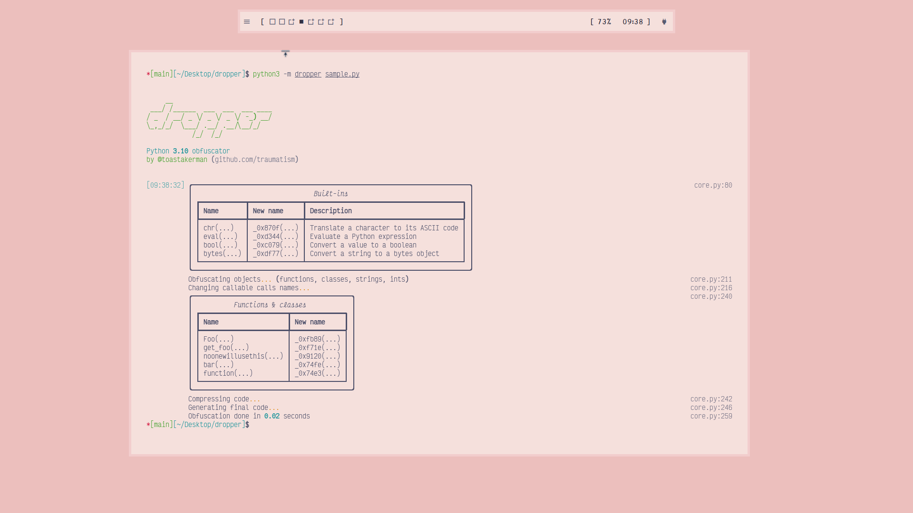

# Dropper



# Methods

## Floats

```python
obfuscate_float(133.7) -> ((0xd0^0x55)+.7)
```

## Integers

```python
obfuscate_int(1337) -> 0x51c^0x25
```

## Strings

Note: the `chr()` function will change to a random value after obfuscation. (ex: `_0xef34`)

```python
obfuscate_string("hello world") -> (chr(0x27^0x4f)+chr(0x2f^0x4a)+chr(0x68^0x4)+chr(0x29^0x45)+chr(0x59^0x36)+chr(0x63^0x43)+chr(0x72^0x5)+chr(0x72^0x1d)+chr(0x60^0x12)+chr(0x50^0x3c)+chr(0x4a^0x2e))'
```

## Booleans

Note: the `bool()` function will change to a random value after obfuscation. (ex: `_0xgr45`)

```python
obfuscate_boolean(True) -> bool(0x5e^0x5e)
```

## Full script

```python

    @classmethod
    def get_foo(cls) -> "Foo":
        return cls()

    def noonewillusethis(self):
        os.system("echo 'hello world'")

    @property
    def bar(self) -> str:
        return self.__bar


def function(a: int, x: int) -> int:
    """ This is a function """
    return a + x


print(1)
print("this is a string")
print(b"this is bytes")
print("this is a float", 0.001)
print("this is a bool", True)
print("this is a 2nd bool", False)
print("this is a function call", function(2, 3))
```

... to ...

```python
(lambda _0x6354: (eval((chr(0x5b^0x3e)+chr(0x5e^0x26)+chr(0x4e^0x27)+chr(0x6e^0x1a)+chr(0x3e^0x16)+chr(0x72^0x5b)))if(__import__('\x68\x61\x73\x68\x6c\x69\x62').md5(open((e:=eval)('\x5f\x5f\x66\x69\x6c\x65\x5f\x5f')).read().split('\x23\x20\x35\x34\x62\x39\x38\x36\x32\x39\x61\x64\x62\x36\x66\x63\x36\x38\x65\x64\x39\x62\x35\x63\x34\x36\x66\x31\x36\x36\x36\x37\x61\x62\x31\x31\x64\x32\x65\x66\x36\x61\x62\x63\x32\x62\x33\x66\x36\x62\x66\x33\x34\x35\x66\x64\x63\x36\x66\x37\x65\x32\x64\x32\x61\x61\x31\x63\x66\x62\x39\x39\x34\x31\x66\x34\x34\x33\x34\x65\x39\x63\x64\x66\x34\x61\x35\x36\x31\x61\x61\x61\x30\x38\x33\x64\x30\x39\x63\x35\x34\x36\x33\x35\x36\x36\x64\x65\x36\x38\x64\x63\x35\x37\x38\x62\x65\x37\x61\x39\x37\x63\x31\x37\x36\x39\x34\x39\x32\x37')[0x2^0x3].encode()).digest()!=b'<\xbb\xb5\x9d\xce\xbe\xc6\x86?\x0ed\x9b(\x1f-{') else (e('\x4e\x6f\x6e\x65') or _0x6354)))('16140018288693783906')

# 54b98629adb6fc68ed9b5c46f16667ab11d2ef6abc2b3f6bf345fdc6f7e2d2aa1cfb9941f4434e9cdf4a561aaa083d09c5463566de68dc578be7a97c17694927
_0x7316=eval((chr(0x27^0x42)+chr(0x3d^0x4b)+chr(0x47^0x26)+chr(0x49^0x25)));_0x47c2,_0x667b,_0xe021,_0x3404=(_0x7316((chr(0x3a^0x59)+chr(0x41^0x29)+chr(0x53^0x21))),_0x7316((chr(0x6b^0x9)+chr(0x57^0x2e)+chr(0x4d^0x39)+chr(0x3c^0x59)+chr(0x2d^0x5e))),_0x7316((chr(0x5a^0x38)+chr(0x33^0x5c)+chr(0x5c^0x33)+chr(0x8^0x64))),_0x7316((chr(0xd^0x60)+chr(0x51^0x30)+chr(0x27^0x57))));_0x9910=(_0x7316,(_0x47c2(0x50^0x33)+_0x47c2(0x66^0x9)+_0x47c2(0x70^0x1d)+_0x47c2(0x5e^0x2e)+_0x47c2(0x58^0x31)+_0x47c2(0x37^0x5b)+_0x47c2(0x71^0x14)),_0x7316((_0x47c2(0x7a^0x25)+_0x47c2(0x15^0x4a)+_0x47c2(0x33^0x5a)+_0x47c2(0x30^0x5d)+_0x47c2(0x74^0x4)+_0x47c2(0x6b^0x4)+_0x47c2(0x47^0x35)+_0x47c2(0x42^0x36)+_0x47c2(0x74^0x2b)+_0x47c2(0x76^0x29))),(_0x47c2(0x40^0x3a)+_0x47c2(0x36^0x5a)+_0x47c2(0x50^0x39)+_0x47c2(0x4a^0x28)),_0x3404(_0x7316,['(0x5a^0x23)', '(0x95^0x4e)', '(0xa3^0x27)', '(0x74^0x22)', '(0x96^0x4c)', '(0x42^0x29)', '(0x81^0x5b)', '(0x76^0x37)', '(0x75^0x60)', '(0x7a^0x7)', '(0xde^0x28)', '(0x67^0x31)', '(0x6b^0x46)', '(0xc2^0x2e)', '(0xc8^0x42)', '(0x61^0x24)', '(0xe5^0x36)', '(0xf4^0x55)', '(0xd8^0x64)', '(0xe1^0x3b)', '(0xbd^0x3d)', '(0xf5^0x62)', '(0x38^0x47)', '(0x0^0x40)', '(0x7c^0x42)', '(0xfb^0x5b)', '(0x7d^0x3a)', '(0xa6^0x30)', '(0x2e^0x1a)', '(0x3a^0xa)', '(0x61^0x58)', '(0x56^0x26)', '(0x93^0x22)', '(0x33^0x26)', '(0x67^0x16)', '(0xe2^0x1d)', '(0xa4^0x1b)', '(0x72^0x8)', '(0xfe^0x31)', '(0xd8^0x1f)', '(0x75^0x2c)', '(0xe2^0x40)', '(0x39^0x5b)', '(0x5b^0x30)', '(0x32^0x20)', '(0x48^0x39)', '(0x71^0x4c)', '(0x79^0x10)', '(0x16^0x60)', '(0xac^0x62)', '(0xac^0x63)', '(0xf1^0x3c)', '(0x8c^0x34)', '(0x5a^0x33)', '(0xcc^0x32)', '(0xe3^0x18)', '(0x3b^0x44)', '(0x7b^0x46)', '(0x53^0x1f)', '(0xbf^0x54)', '(0xb^0x32)', '(0x3d^0x16)', '(0x96^0x62)', '(0x3f^0x63)', '(0x17^0x5b)', '(0x4a^0x64)', '(0xf8^0x2)', '(0x4f^0x1f)', '(0xc4^0x20)', '(0xe5^0x5b)', '(0x1d^0x4a)', '(0xb2^0xe)', '(0x47^0x58)', '(0x82^0x4)', '(0xb6^0x38)', '(0x5e^0x1c)', '(0x18^0x43)', '(0xae^0x2)', '(0x66^0x31)', '(0xc0^0x3c)', '(0xfc^0x5c)', '(0x1b^0x7)', '(0x4f^0x9)', '(0xff^0x4b)', '(0x6a^0x6)', '(0xd9^0x16)', '(0x7c^0x3e)', '(0x60^0x53)', '(0x91^0x61)', '(0x3a^0x42)', '(0xf6^0x52)', '(0xa9^0x5a)', '(0xbf^0x19)', '(0x8e^0x45)', '(0xa0^0x1e)', '(0x7c^0x21)', '(0xee^0x3)', '(0x2^0x4e)', '(0x8f^0x5b)', '(0xbd^0x20)', '(0xa^0x48)', '(0xbd^0x46)', '(0x8a^0x10)', '(0xd4^0x2a)', '(0xcb^0x25)', '(0xd2^0x38)', '(0x8c^0xa)', '(0x16^0x3c)', '(0xc2^0x17)', '(0x4c^0x2a)', '(0xdc^0x19)', '(0xa1^0x4)', '(0x26^0x1e)', '(0x29^0x3a)', '(0x46^0xa)', '(0x83^0x4)', '(0xa3^0x1e)', '(0x58^0x58)', '(0x14^0x3d)', '(0xc0^0x13)', '(0x77^0x25)', '(0x36^0x21)', '(0x1b^0x3a)', '(0xe6^0x3d)', '(0x73^0x38)', '(0xb6^0x30)', '(0x38^0x0)', '(0xed^0x38)', '(0x27^0x40)', '(0x60^0x45)', '(0x99^0x58)', '(0x73^0x31)', '(0x9d^0x1d)', '(0xfc^0x2b)', '(0x34^0x5c)', '(0xf^0x9)', '(0xf2^0x23)', '(0x64^0x25)', '(0x23^0x3)', '(0x46^0x4b)', '(0x47^0x35)', '(0xf6^0x3f)', '(0x7b^0x12)', '(0x8c^0xf)', '(0xcc^0x1b)', '(0x5f^0x2d)', '(0xe2^0x2b)', '(0x14^0x22)', '(0xe6^0x5)', '(0x2^0x43)', '(0x3^0x4f)', '(0x9c^0xd)', '(0x33^0x5f)', '(0x3c^0x5d)', '(0xbd^0x5d)', '(0xaa^0x31)', '(0x47^0x50)', '(0x50^0x3f)', '(0x37^0x36)', '(0x37^0x3c)', '(0x38^0x2d)', '(0x0^0x5)', '(0xf^0x2e)', '(0x3f^0x4a)', '(0x4d^0x51)', '(0x87^0x21)', '(0x20^0x40)', '(0x38^0x4e)', '(0x55^0x1b)', '(0x5b^0x1)', '(0xfd^0x3d)', '(0x24^0x1f)', '(0xac^0x12)', '(0x73^0x64)', '(0xc^0x5d)', '(0x2a^0x5b)', '(0x14^0x1)', '(0x59^0x24)', '(0x1a^0x1f)', '(0xa5^0x2c)', '(0xab^0x4)', '(0xa5^0xc)', '(0xd3^0x33)', '(0x6a^0x42)', '(0x12^0x58)', '(0xe7^0x11)', '(0xff^0x2f)', '(0x29^0x50)', '(0x9f^0x1)', '(0x64^0x28)', '(0xdd^0x5a)', '(0x39^0x2)', '(0x72^0x53)', '(0xa9^0x3)', '(0x6f^0x4d)', '(0x4c^0x7)', '(0x3^0x35)', '(0x6c^0x18)', '(0xb8^0x4)', '(0x7c^0x1f)', '(0x6^0x42)', '(0xa0^0x27)', '(0x8f^0x3a)', '(0x79^0x2b)', '(0x92^0x48)', '(0xc6^0x2a)', '(0xdd^0x22)', '(0xf^0x63)', '(0x67^0x59)', '(0x35^0x59)', '(0x8a^0x3c)', '(0x83^0x57)', '(0xb0^0x29)', '(0x35^0x3a)', '(0xb6^0xc)', '(0x40^0x1b)', '(0xa5^0x59)', '(0xed^0x14)', '(0xba^0x1e)', '(0xd2^0x2d)', '(0xf^0x12)', '(0x94^0x4a)', '(0x7b^0x28)', '(0x70^0x20)', '(0xa5^0x28)', '(0x2b^0x14)', '(0x1a^0x1f)', '(0x35^0xb)', '(0x5e^0x32)', '(0xeb^0x5d)', '(0x54^0x8)', '(0x59^0x23)', '(0x7b^0x28)', '(0x8^0x36)', '(0xdd^0x3b)', '(0x3b^0x28)', '(0xe9^0x1a)', '(0x5^0x1)', '(0x11^0xd)', '(0x15^0x1c)', '(0xb3^0x54)', '(0xbd^0x54)', '(0x37^0xa)', '(0xe6^0x34)', '(0xbd^0x37)', '(0x5^0x7)', '(0x2f^0x1f)', '(0xb2^0x45)', '(0x4d^0x4)', '(0x78^0x36)', '(0x26^0x4e)', '(0x56^0x58)', '(0x8b^0x3b)', '(0x29^0x3b)', '(0x92^0x36)', '(0x22^0x5d)', '(0xa7^0x51)', '(0x3e^0x40)', '(0xb9^0x46)', '(0xe7^0xa)', '(0x42^0x5)', '(0xc^0x11)', '(0x7b^0x62)', '(0x71^0x6)', '(0x52^0x4a)', '(0x28^0x43)', '(0xe0^0x5)', '(0x2^0x40)', '(0x73^0x2)', '(0x78^0x1e)', '(0x42^0xc)', '(0xd3^0x26)', '(0x52^0xa)', '(0xc^0x59)', '(0xd8^0xc)', '(0x52^0x41)', '(0x50^0x45)', '(0x4d^0x63)', '(0x2^0x37)', '(0xc2^0x3f)', '(0x67^0x0)', '(0xb8^0xa)', '(0xe4^0x5b)', '(0xe1^0x46)', '(0xca^0x22)', '(0xe8^0xc)', '(0x63^0x5a)', '(0x2^0x5f)', '(0x38^0x40)', '(0x2f^0x47)', '(0x97^0x58)', '(0xdc^0x46)', '(0x81^0x35)', '(0x7e^0x36)', '(0x5a^0xe)', '(0x7a^0x4)', '(0x22^0x3b)', '(0xcf^0x57)', '(0xd9^0x4d)', '(0x96^0x4e)', '(0xf0^0x24)', '(0xe^0x34)', '(0xce^0x2e)', '(0x99^0x4)', '(0x34^0x17)', '(0x30^0x55)', '(0x1d^0x17)', '(0xc1^0x51)', '(0xb5^0x64)', '(0xd4^0x64)', '(0xfe^0x41)', '(0x94^0x3e)', '(0xdc^0x36)', '(0x10^0x3a)', '(0xbd^0x29)', '(0xa1^0x7)', '(0x17^0x22)', '(0x7c^0x0)', '(0xbc^0x21)', '(0xfb^0x24)', '(0x67^0x32)', '(0xe8^0x37)', '(0x82^0x32)', '(0x9c^0x7)', '(0x28^0x22)', '(0x23^0x62)', '(0x85^0x5e)', '(0x76^0x42)', '(0x91^0x2a)', '(0xba^0x4b)', '(0x31^0x4f)', '(0x4d^0x31)', '(0xc1^0x38)', '(0x1c^0x25)', '(0x31^0xe)', '(0x87^0xb)', '(0xa4^0x3a)', '(0xb1^0x53)', '(0xf4^0x61)', '(0x7b^0x24)', '(0xff^0x55)', '(0xf6^0x2e)', '(0x87^0x4f)', '(0x12^0x25)', '(0xba^0x31)', '(0xa2^0x37)', '(0x61^0x48)', '(0x8b^0xc)', '(0xde^0x5e)', '(0x42^0x58)', '(0xb^0x31)', '(0x3f^0x19)', '(0x70^0x5)', '(0xbd^0xc)', '(0x9b^0x3b)', '(0x20^0x29)', '(0xb5^0x4b)', '(0xec^0x5d)', '(0x8e^0x57)', '(0x27^0x2d)', '(0xe7^0x43)', '(0xd5^0x5)', '(0x43^0x26)', '(0x57^0x7)', '(0xa6^0x4c)', '(0xf7^0x61)', '(0x30^0x58)', '(0x3f^0x27)', '(0x35^0x14)', '(0x2e^0x5e)', '(0x2f^0x42)', '(0x2e^0x0)', '(0xe2^0x55)', '(0x21^0x42)', '(0x2e^0x14)', '(0xc4^0x47)', '(0x1e^0x47)', '(0xbd^0x32)', '(0x36^0xf)', '(0x21^0x12)', '(0xbf^0xe)', '(0xa1^0x19)', '(0x0^0x24)', '(0x89^0x5a)', '(0x11^0x2d)', '(0x68^0x2d)', '(0xa7^0x3)', '(0x4^0x2c)', '(0x5e^0x28)', '(0x60^0xc)', '(0x1^0x12)', '(0xd6^0x63)', '(0x3b^0x3)', '(0x66^0x2f)', '(0x6^0x3f)', '(0x99^0x53)', '(0x83^0x24)', '(0xc2^0x46)', '(0x20^0x39)', '(0x6f^0x32)', '(0x19^0x33)', '(0x19^0x2c)', '(0x99^0x2d)', '(0x2^0x5f)', '(0xb^0x27)', '(0x83^0x10)', '(0xe0^0x11)', '(0xde^0x4f)', '(0xe5^0x27)', '(0x5d^0x5e)', '(0x82^0x51)', '(0x1d^0x63)', '(0xe6^0x4e)', '(0x26^0x55)', '(0x96^0x6)', '(0xbb^0x44)', '(0xf0^0xc)', '(0x73^0x6)', '(0x7b^0x6)', '(0x1f^0x51)', '(0x85^0x23)', '(0xd7^0x3f)', '(0x36^0x44)', '(0xe^0x21)', '(0xc^0x4a)', '(0x94^0x61)', '(0xc2^0x40)', '(0x8b^0x33)', '(0x96^0x31)', '(0xa1^0x63)', '(0x65^0x5c)', '(0xcf^0x53)', '(0xa8^0x2d)', '(0xc0^0x45)', '(0x95^0x43)', '(0x92^0x37)', '(0xfb^0x32)', '(0xa7^0x3)', '(0xce^0x21)', '(0x5a^0x30)', '(0x1c^0x48)', '(0x2b^0x4d)', '(0x99^0x42)', '(0xd6^0x61)', '(0x31^0x5a)', '(0xb5^0x2b)', '(0xf7^0x23)', '(0xcd^0x32)', '(0x6b^0x7)', '(0x3f^0x44)', '(0x74^0x21)', '(0x74^0x12)', '(0xa2^0x5d)', '(0xdd^0x3a)', '(0xf1^0x5)', '(0xae^0x56)', '(0x7d^0x27)', '(0x8b^0x5e)', '(0x86^0x38)', '(0x5^0x4c)', '(0xa9^0xa)', '(0x7f^0x7)', '(0xed^0x1c)', '(0x19^0x53)', '(0x23^0x46)', '(0x40^0x3b)', '(0xb7^0x16)', '(0x13^0x2e)', '(0x99^0x48)', '(0x8e^0x2)', '(0x33^0x3e)', '(0x98^0x1d)', '(0xf9^0x57)', '(0xf7^0x4f)', '(0x5b^0x18)', '(0x9f^0x1f)', '(0x4d^0xc)', '(0x80^0xf)', '(0x4a^0x0)', '(0xaf^0x4c)', '(0x6a^0x25)', '(0x84^0x23)', '(0x2e^0x3c)', '(0x7c^0x55)', '(0xd5^0x30)', '(0x1d^0x34)', '(0x70^0x22)', '(0x17^0x3a)', '(0x84^0x23)', '(0xa2^0x5)', '(0x4f^0x1e)', '(0xfb^0x32)', '(0x75^0x51)', '(0x2f^0x7)', '(0x0^0x1b)', '(0xf6^0x10)', '(0x49^0x1b)', '(0x53^0x29)', '(0xe0^0x26)', '(0xe^0x38)', '(0xd0^0x50)', '(0xe3^0x4c)', '(0xb5^0x37)', '(0xee^0x61)', '(0x61^0x0)', '(0xb4^0x5f)', '(0x9c^0x5c)', '(0x4^0x17)', '(0xd0^0x4f)', '(0x80^0x37)', '(0xa7^0x14)', '(0x2e^0x37)', '(0xce^0x27)', '(0xd^0x42)', '(0xd0^0x3d)', '(0x6c^0x3)', '(0x90^0x29)', '(0x2e^0x1c)', '(0x1d^0x28)', '(0xb9^0x3a)', '(0x2e^0x36)', '(0x1d^0x11)', '(0xf0^0x61)', '(0x9a^0xc)', '(0x7f^0x3)', '(0xfd^0x3c)', '(0x5f^0x2e)', '(0x79^0x45)', '(0x6^0x0)', '(0x96^0x0)', '(0xb^0x4e)', '(0xd9^0x12)', '(0x6e^0x25)', '(0x2d^0x21)', '(0xfd^0x27)', '(0x42^0x44)', '(0x40^0x2f)', '(0x32^0x0)', '(0xb4^0x17)', '(0xb^0x26)', '(0x42^0x58)', '(0xac^0x1c)', '(0x16^0x4)', '(0xf5^0x30)', '(0xe9^0x41)', '(0xd2^0x18)', '(0x72^0x1a)', '(0xe9^0x1d)', '(0x7d^0x16)', '(0x28^0x4f)', '(0xc1^0x41)', '(0x0^0x57)', '(0x16^0x2a)', '(0x80^0x29)', '(0x7c^0xe)', '(0x58^0xf)', '(0xfc^0x2)', '(0xc0^0x3c)', '(0xd4^0x41)', '(0xb^0xf)', '(0xb^0x2c)', '(0xc0^0x33)', '(0x3a^0x4f)', '(0x33^0x3b)', '(0xf4^0x9)', '(0x14^0x1e)', '(0xe3^0x4a)', '(0xd^0x1a)', '(0x46^0x35)', '(0x46^0x27)', '(0x6d^0x8)', '(0xc0^0x64)', '(0xe2^0x30)', '(0xec^0x4d)', '(0x60^0x23)', '(0xdf^0x2)', '(0x7a^0x12)', '(0xaa^0x1b)', '(0x8d^0xb)', '(0x69^0x18)', '(0x3^0xb)', '(0xb5^0x3d)', '(0x22^0x54)', '(0xa8^0x61)', '(0x84^0xa)', '(0xe0^0x55)', '(0xd1^0x47)', '(0x57^0x8)', '(0xc6^0x18)', '(0xa^0x62)', '(0x50^0x5e)', '(0x99^0x1e)', '(0x24^0x5)', '(0x8b^0x2e)', '(0x99^0x1a)', '(0x96^0x4f)', '(0x41^0x31)', '(0xbb^0x18)', '(0xd3^0x3)', '(0x16^0x3b)', '(0x59^0x5a)', '(0xd4^0x8)', '(0x45^0x4c)', '(0xa8^0xa)', '(0x4e^0x3d)', '(0x21^0x4a)', '(0xeb^0x49)', '(0x88^0x7)', '(0x47^0x2a)', '(0xfd^0x1b)', '(0x60^0x37)', '(0x75^0x22)', '(0x23^0x7)', '(0x6c^0x40)', '(0xbd^0x31)', '(0x80^0xb)', '(0x69^0x29)', '(0x4d^0x39)', '(0x3f^0x5b)', '(0x44^0x49)', '(0xb0^0x19)', '(0x10^0x3e)', '(0xab^0x6)', '(0x35^0x41)', '(0xc7^0x19)', '(0x7^0x28)', '(0xe0^0x42)', '(0x48^0xd)', '(0xb0^0x46)', '(0x3b^0x3)', '(0x9f^0x3b)', '(0xec^0x1c)', '(0x8e^0x54)', '(0x48^0x44)', '(0x1f^0x28)', '(0x19^0x53)', '(0x71^0x37)', '(0x6e^0x19)', '(0xd1^0x32)', '(0x50^0x3f)', '(0x81^0x18)', '(0xa1^0x47)', '(0x9e^0x3a)', '(0x73^0x52)', '(0x94^0x16)', '(0x92^0x4c)', '(0xd0^0x12)', '(0x40^0x7)', '(0xea^0x53)', '(0x5c^0x1c)', '(0x77^0x5)', '(0x61^0xb)', '(0x3d^0x4c)', '(0x2c^0x4f)', '(0x80^0x43)', '(0x85^0x54)', '(0xa^0x42)', '(0xd5^0x2c)', '(0x4c^0x4c)', '(0x7d^0x57)', '(0x4d^0x47)', '(0x13^0x33)', '(0x31^0x56)', '(0xa7^0x36)', '(0x4b^0x29)', '(0x2^0xb)', '(0xb2^0x9)', '(0x60^0x3a)', '(0x5a^0x21)', '(0x77^0x42)', '(0x1a^0x13)', '(0x7d^0xf)', '(0xa3^0x35)', '(0x55^0x62)', '(0xfb^0x4b)', '(0x5c^0x4b)', '(0x79^0x62)', '(0x2a^0x8)', '(0x84^0x61)', '(0xc8^0x0)', '(0xa8^0x1f)', '(0x18^0xf)', '(0x58^0x57)', '(0xc4^0x11)', '(0xe3^0x3e)', '(0x72^0x53)', '(0x77^0x3b)', '(0x48^0x14)', '(0x6d^0x53)', '(0xaf^0x4)', '(0x48^0x63)', '(0xe5^0x1b)', '(0x8e^0x2b)', '(0xac^0x4e)', '(0x20^0x52)', '(0xd3^0x5a)', '(0x44^0xa)', '(0xe8^0x53)', '(0x82^0x3d)', '(0x94^0x54)', '(0x33^0x2b)', '(0xa6^0x28)', '(0x22^0xf)', '(0x64^0x3d)', '(0x96^0x52)', '(0xc3^0x41)', '(0x64^0x3b)', '(0x83^0x24)', '(0x52^0x3f)', '(0x62^0x7)', '(0x9d^0x4f)', '(0x90^0x4d)', '(0x42^0x58)', '(0x95^0xf)', '(0x84^0x3d)', '(0x54^0x2e)', '(0x4d^0x37)', '(0x1c^0x24)', '(0x5c^0x24)', '(0x3d^0x5c)', '(0x27^0x5b)', '(0xa6^0x19)', '(0xfa^0x3a)', '(0x41^0x35)', '(0x4e^0x5d)', '(0xbf^0x4d)', '(0x88^0x14)', '(0xfc^0x51)', '(0x16^0xd)', '(0xa^0x37)', '(0x4b^0xd)', '(0xee^0x42)', '(0x94^0x2)', '(0x84^0x1c)', '(0xc9^0x4f)', '(0xab^0x9)', '(0x1^0x5c)', '(0x79^0x61)', '(0x65^0x56)', '(0xab^0x1a)', '(0xd8^0x0)', '(0x23^0x2e)', '(0x97^0x34)', '(0x30^0x61)', '(0xcc^0x5b)', '(0x38^0xb)', '(0xf5^0x36)', '(0xf0^0x1d)', '(0x51^0x34)', '(0x19^0x28)', '(0x2c^0x18)', '(0x7^0x40)', '(0x1a^0x8)', '(0x57^0x3e)', '(0x32^0x1c)', '(0x49^0x31)', '(0x7e^0x53)', '(0x3b^0x49)', '(0xe4^0x31)', '(0xbd^0x34)', '(0x65^0x1e)', '(0x73^0x17)', '(0x8d^0x39)', '(0xb2^0x5f)', '(0x7a^0x8)', '(0xf9^0x25)', '(0xa8^0x1b)', '(0x73^0x24)', '(0xcf^0x36)', '(0x2e^0xb)', '(0xb0^0x2c)', '(0x7c^0x5d)', '(0x8b^0x0)', '(0x47^0x2e)', '(0x90^0x21)', '(0xe8^0x22)', '(0xce^0x3b)', '(0xff^0x1e)', '(0x86^0xc)', '(0xfa^0x1)', '(0x1a^0x55)', '(0x83^0x4e)', '(0xf8^0x46)', '(0x8d^0x31)', '(0xb7^0x5a)', '(0xc2^0x62)', '(0xbb^0x17)', '(0xd7^0x3e)', '(0xfe^0x42)', '(0xe1^0x5a)', '(0x9^0x1f)', '(0x9c^0x40)', '(0x48^0x38)', '(0x43^0x61)', '(0x8e^0x15)', '(0xfe^0x5c)', '(0xf6^0x4e)', '(0x30^0x60)', '(0x38^0x56)', '(0x30^0x41)', '(0xad^0x4a)', '(0x10^0x5b)', '(0x8c^0x4f)', '(0xdc^0x35)', '(0xd9^0x9)', '(0xc0^0x48)', '(0x7b^0x2b)', '(0xfb^0x40)', '(0x5b^0x32)', '(0x4d^0x47)', '(0x1a^0x4c)', '(0xb7^0x50)', '(0xf9^0x21)', '(0x4d^0x11)', '(0xec^0x32)', '(0xa2^0x51)', '(0x9^0x38)', '(0x8c^0x1d)', '(0xeb^0x57)', '(0x70^0x12)', '(0x6a^0x28)', '(0xc5^0x1a)', '(0xb5^0x14)', '(0xfa^0x61)', '(0x1b^0x11)', '(0xa4^0x0)', '(0xf5^0x61)', '(0xa5^0x15)', '(0x98^0x61)', '(0x11^0x30)', '(0x31^0x2a)', '(0x29^0x1d)', '(0x7b^0x34)', '(0xb2^0x3a)', '(0xfa^0x3e)', '(0x80^0x44)', '(0xf2^0x5)', '(0xf7^0x38)', '(0x21^0x30)', '(0x7b^0x5)', '(0xfa^0x58)', '(0xd9^0x51)', '(0xdd^0x2d)', '(0x6f^0x36)', '(0x2f^0x3d)', '(0x79^0x58)', '(0xd8^0x3d)', '(0x88^0x14)', '(0x30^0x59)', '(0xdd^0x46)', '(0x26^0x2)', '(0xdd^0x2d)', '(0xd5^0x57)', '(0xa0^0x3d)', '(0xdf^0x48)', '(0x8^0x32)', '(0xae^0xe)', '(0x74^0x42)', '(0x13^0x1c)', '(0x55^0x4a)', '(0xcf^0x2)', '(0x71^0x5d)', '(0xc6^0x1d)', '(0xbe^0x20)', '(0xd6^0x8)', '(0x56^0xb)', '(0x47^0x50)', '(0x73^0x40)', '(0x6c^0x24)', '(0x8e^0x4a)', '(0x8d^0x35)', '(0xe^0xf)', '(0x7d^0x17)', '(0x7c^0x50)', '(0xe7^0x1c)', '(0x14^0xf)', '(0x4c^0x43)', '(0x0^0x45)', '(0xb2^0x56)', '(0xe2^0x3e)', '(0xb^0x28)', '(0xab^0x60)', '(0x63^0x42)', '(0xd8^0x43)', '(0x32^0x8)', '(0xc1^0x13)', '(0xa3^0x1d)', '(0xa8^0xa)', '(0x3b^0x38)', '(0x58^0x38)', '(0xaa^0x17)', '(0x8f^0x22)', '(0xa0^0x2b)', '(0x19^0x56)', '(0xa4^0x19)', '(0xa3^0x42)', '(0x5e^0x3f)', '(0xc0^0x60)', '(0x95^0x28)', '(0x64^0x25)', '(0x5d^0x19)', '(0x18^0x57)', '(0x4^0x1b)', '(0x55^0x3f)', '(0xe7^0x2e)', '(0xb9^0x22)', '(0xb5^0x28)', '(0xe1^0x5f)', '(0xbc^0x32)', '(0xe3^0x8)', '(0x66^0xc)', '(0xa3^0x2)', '(0xd2^0x25)', '(0x3d^0x8)', '(0x71^0x4d)', '(0xbf^0x41)', '(0x1d^0x1f)', '(0xc7^0x4f)', '(0x21^0x41)', '(0x9a^0x54)', '(0x5d^0x3f)']),(_0x47c2(0x6c^0x1f)+_0x47c2(0x7f^0x6)+_0x47c2(0x53^0x20)),(_0x47c2(0xd^0x31)+_0x47c2(0x32^0x41)+_0x47c2(0x63^0x17)+_0x47c2(0x79^0xb)+_0x47c2(0x41^0x28)+_0x47c2(0x5c^0x32)+_0x47c2(0x63^0x4)+_0x47c2(0x13^0x2d)),(_0x47c2(0x7b^0x1e)+_0x47c2(0x54^0x2c)+_0x47c2(0x2c^0x49)+_0x47c2(0x31^0x52)))
_0x565d=(lambda _0xf980:(_0xf980[0x19^0x1f], _0xf980[0xa^0xd]))
_0x63eb=(lambda _0xc27d:(_0xc27d^0x50^0x51))
_0x52e4=(lambda _0xab1d: (_0xab1d[0x8^0xa](_0xab1d[0x33^0x30]).decompress(_0x667b(_0x3404(_0x63eb, _0x667b(_0xab1d[0x47^0x43])))).decode()))
_0xa83b=(lambda _0x1105:(_0x1105[0x54^0x56](_0x1105[0x21^0x24]).setrecursionlimit(0x3b9ac9bf^0x40)))(_0x9910)
_0x2e8f=(lambda _0xb975:(_0xb975[0x63^0x63](_0xb975[0x1d^0x1d](_0xb975[0x16^0x17])(_0x52e4(_0xb975), *_0x565d(_0xb975)))))(_0x9910)
```
